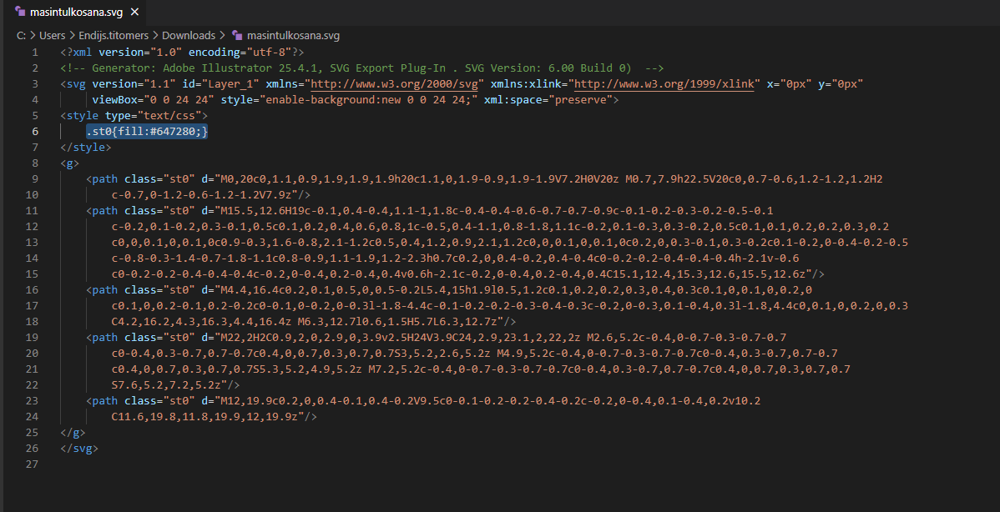
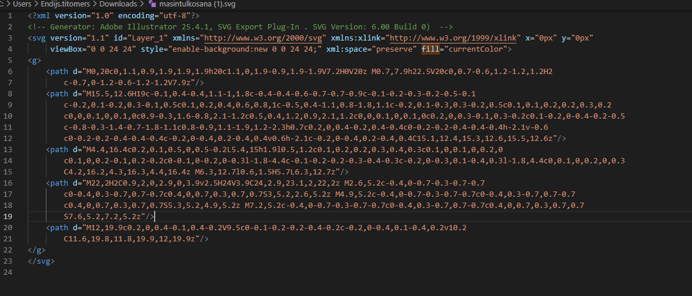
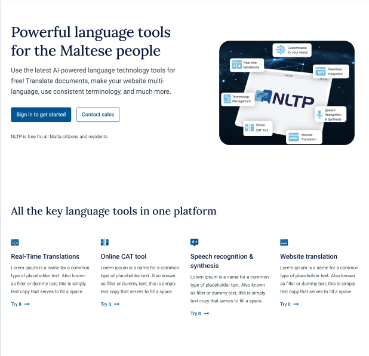
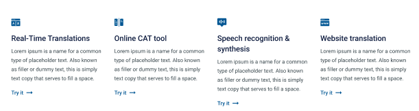

# CMS deployment and configuration

NLTP CMS is built on Strapi. With Strapi you can easily manage your content in the NLTP project. This document describes created models for the NLTP project and their use cases. To better understand Strapi basics, it is suggested to get familiar with the official Strapi [documentation](https://docs.strapi.io/developer-docs/latest/getting-started/introduction.html).

## Importing assets

When deploying CMS for the first time, a manual file import is necessary.

Files from `cms_files.zip` must be manually copied to `cms-data-pv-claim` storage. You can use these commands to do that (CMS component must be deployed and running beforehand):

```bash
POD=`kubectl get pod | grep cms | awk {'print $1'}` # Find CMS Pod name
kubectl cp cms_files.zip $POD:/tmp/cms_files.zip # Copy archive to server
kubectl exec $POD -- sh -c "unzip -o /tmp/cms_files.zip -d /opt/app/public/uploads/" # Extract files
```

**Note:** Uploading files using the admin panel is not supported, as it will generate different filenames from the ones listed in the SQL file.

## Changing the default admin account password

The default admin password must be changed to prevent unauthorized access.

In order to change the password for the default admin account visit `https://nltp-cms.example.com/admin/settings/users/1`, login with default credentials:

* User: `cmsuser@example.com`
* Password: `CMSpass321`

Enter a new password and save.

# CMS Customization

Following section describes how to customize CMS content after deployment.

## Content manager

You can add and manage your content in the Content manager page.

### Menu items

This content type is created for adding custom menu items in side nav and mobile menu. Please, be aware that "Languagetools" column from the menu is defined in the application and is not configurable from cms, it is possible to configure menu items that are under divider.

Fields:

*icon* - icon to be shown next to the item or when side nav is collapsed. This should be an image with **.svg** type.

*title* - menu item title.

*link* - link where the menu item should go. You can add relative ("/my-link") or absolute. Relative links in the menu library are treated as Angular routes (check 
_externalLink_ property for exceptions). 

*customID* - this gives element a custom id. Field can be left empty.

*disabled* - this property determines menu item visibility. If you want to hide menu item, set it to true.

*externalLink* - opens link in new tab.

*plausibleEvent* - event for Plausible analytics, if it is used. You can leave this empty if Plausible is not used in the app. Check [Plausible event](#plausible-event) for more details. 

#### Menu item icon color

There might be cases when the selected icon is not changing color to accent color. The color might be hard coded and there is no (or not good) way to change it from front-end code. If you want the icon to also be colored, you need to edit the icons' `.svg` file manually.

Menu lib has styles that set icon color for the selected element (to accent color). The library expects icon elements that should be colored to have fill property set to currentColor.

First step is to open the icons file in a text editor (notepad or any other of your choice):

Here is example svg of icon where currentColor is not working:



As we can see,  the designer has created a custom class st0 whose fill attribute is set to some color. In the front-end, we could override these classes styles to achieve the desired result, but that would not be the best solution, since some random class names are not good practice and there are no rules in Tilde what classes should be formatted.

**Steps to fix this svg file:**

+ remove 
`.st0{fill:#647280;}` from svg file (if `<style>` tag is empty, remove it also).
+ remove `class="st0"` from path tags
+ add `fill="currentColor"` to `<svg> tag`

file after editing:



### Product information page

Type is used for landing pages or other information pages with a predefined template. 
This type is displayed in the product "about" pages. You can define your own custom route for every page template and the app will know how to use it.

Predefined template example:



Fields:

*route* - custom route to display current page. For example, if you set route to `about-project` this page can be accessed through https://example.com/**about-project** .

*title* - page title

*head* - this is a dynamic zone where you can choose from link-button, HTML and link components (read more about these components below). Everything that is defined in head, will appear in column next to image.

*body* - this is a dynamic zone where you can choose from link-button, HTML, link, feature list and image title content links components (read more about these components below). Everything that is defined in body will appear below the image and head.

*company* - used for the user to easier distinguish created pages, this is not displayed anywhere. You can leave this empty.

*productName* - used for the user to easier distinguish created pages, this is not displayed anywhere. You can leave this empty.

*image* - main page image.

### Cat

This type is created to provide custom content for "CAT tool" page. 

Fields:

*introduction* - field with a rich text editor that show up in "CAT tool" page above CAT tool.

Please check [product pages](#product-pages) section to see additional fields.

### Cookie consent

This type provides an option to modify text in cookie consent window.

Fields:

*title* - title.

*description* - description.

*accept_button* - accept button text.

*decline_button* - reject/decline button text.

### Mt main

This type is global for the whole application and is not tied to any specific page. 

Fields: 

*footer* - application footer HTML content. This footer will be visible in all pages.

### MT Website Translator

This type is used in "Website translator" page for displaying "About" page for authorized-unauthorized users.

Please check [product pages](#product-pages) section to see additional fields.

### Privacy policy

Type for privacy policy content.

Fields: 

*text* - privacy policy content.

### Terms of service

Type for terms of service content.

Fields: 

*text* - terms of service content.

### Trados plugin

This type is used in "Trados plugin" page for displaying "About" page for authorized-unauthorized users.

Please check [product pages](#product-pages) section to see additional fields.

### Translator

This type is used in "Machine translation" page and it provides option for adding custom content above and below the translation form.

fields:

*header* - content that is displayed above translation form. It gives option to choose from [feature list](#feature-list), [link button](#link-button) and [html](#html) components.

*footer* - content that is displayed below translation form. It gives option to choose from [feature list](#feature-list), [link button](#link-button) and [html](#html) components.

## Product pages

This is not defined separately as type, but there are some common fields among some product pages. Since the logic is the same for all of these, main functionality is summarized here. Fields defined here are used in the following types:
- [Trados plugin](#trados-plugin)
- [Cat](#cat)
- [Website translator](#mt-website-translator)

Fields: 

*aboutPage* - "About" page for given product for authorized user, which is relation to product information page. First, you need to create page in `Product information page` type and then select it in the drop-down provided.

*aboutPageLimited* - "About" page for given product for unauthorized user, which is relation to product information page. First, you need to create page in `Product information page` type and then select it in the drop-down provided.

**Note. If you want, you can select the same page for authorized and unauthorized users.**

## Components

Components are models that can be reused between different content types.

### Dynamic heading

Component provides an option to select the appropriate size of heading based on the page structure. This component should be used where a title is needed. At the time of writing, it is used in the feature list. For this component you select heading size. Heading levels should follow order h1->h5 to meet best practices and accessibility guidelines:

```html
<container>
<h1>Top level heading</h1>
something....
<h2>Second level heading</h2>
</container>
...
```

Fields: 

*headingSize* - size of the HTML heading. Choose one of the given values.

*text* - heading text.

*styles* - option to add some custom styles (such as padding and margin). Please check [styles](#styles) component for more information.

### Link

This component allows you to create a link with an icon of your choice from [Google font icons](https://fonts.google.com/icons) and place it before or after the link label. Icon name should be lowercase and underscore should be concatenation symbol. For example, if icon name is `Toggle on`, in cms it should be converted to `toggle_on`.

Fields: 

*title* - link text.

*link* - link value. It is possible to use relative links for routes in current application and absolute links for external URLs. Please, make sure to include protocol for external URLS (for example https://google.com, where HTTPS is protocol).

*aria-label* - descriptive text for link which improves accessibility.

*icon-position* - icon (if it is necessary) position. Choose one of given values.

*icon* - preferred icon from Google font icons.

*externalLink* - set to true if link is outside of an app or you want to use some of basic `<a>` tag functionality (for example - mailto). Url will be opened in new window.

### Link button

Necessary for creating custom links that appear as buttons.

Fields: 

*type* - button type based on Angular material [button](https://material.angular.io/components/button/overview).

*color* - button color.

*link* - item link - relation to [link](#link) component.

*plausibleEvent* - event for Plausible analytics, if it is used. You can leave this empty if Plausible is not used in app. Check [Plausible event](#plausible-event) for more details. 

### Html

Component can be used in dynamic zones for creating formatted text with rich text editor, it also gives possibility to add custom HTML code.

Fields: 

*content* - HTML content.

### Plausible event

This component allows to add [plausible](https://plausible.io/) events if Plausible Analytics are used. 

Fields: 

*eventId* - Plausible event id, this should be exactly the same as defined in Plausible analytics.

*properties* - key and value pairs which are as data for plausible event. Please check [Key value](#key-value) component info.

### Styles

This component provides option for customizing some of CSS styles - you can set custom padding and margin - those should be set same as in CSS. Info about [padding](https://www.w3schools.com/css/css_padding.asp) and [margin](https://www.w3schools.com/css/css_margin.asp) in CSS.

Fields: 

*padding* - CSS padding.

*margin* - CSS margin.

### Key value

Fields: 

*key* - object key.

*value* - object value.

### Feature list

There is specific type created for displaying feature list with n number of elements. It has 2 main elements - dynamic heading and list items. Check the list example below:



To create such a list in your product-information-page, you need to use dynamic zone which is available in body and fill it out accordingly.

Fields:

*items* - feature list items that uses [feature list item](#feature-list-item) model.

*title* - list title that is made from [dynamic heading](#dynamic-heading) model.

### Feature list item

Model that is used to display items in feature list.

Fields: 

*title* - list item title.

*description* - list item description.

*icon* - item icon.

*link* - item link - relation to [link](#link) component. This is necessary if you want to add "learn more" link for example. 

### Image title content links

Component created to make product information page body more interactive. This component has predefined template where image - content - link buttons are displayed in this exact order. 

Fields:

*title* - section title. Check [dynamic heading](#dynamic-heading) for more info.

*image* - section image.

*imageFloat* - in which side image should be floated, select one of predefined values.

*text* - HTML component for the section content. Check [html](#html) component for more info.

*buttons* - list with link buttons. Check [link button](#link-button) for more info.


